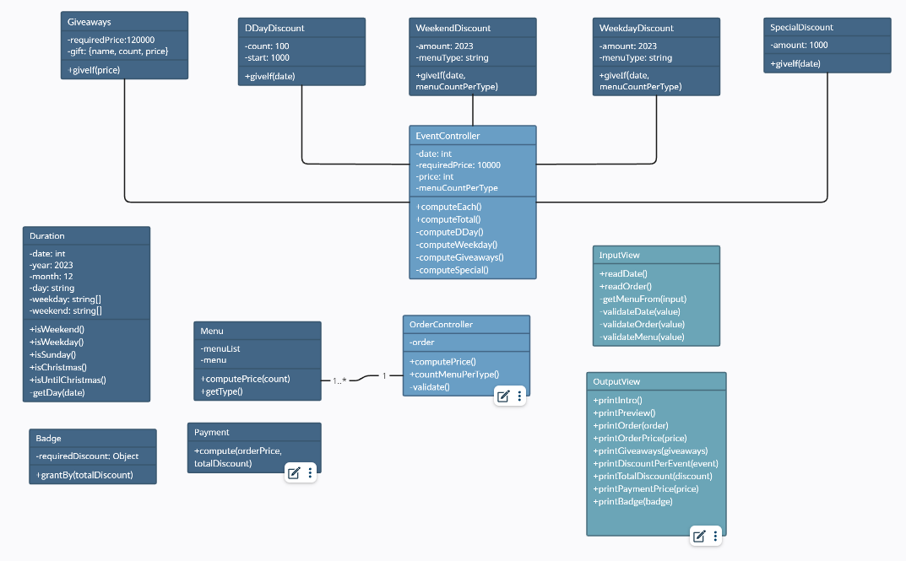

# 미션 - 크리스마스 프로모션

## 한줄 소개

**올해 12월**에 음식점을 방문한 고객에게 **크리스마스 할인 이벤트**를 제공하는 미션입니다.

## 실행 가이드

- 테스트 패키지 설치를 위해 `Node.js` 버전 `18.17.1` 이상이 필요합니다.
- 다음 명령어를 입력해 패키지를 설치합니다.

```bash
npm install
```

- 설치가 완료되었다면, ./src/index.js 파일을 실행합니다.

```javascript
import App from "./App.js";

new App().run();
```

### 전체 실행 모습

- **방문 날짜**와 **주문 메뉴**를 입력하시면 할인이 적용된 모습을 확인할 수 있습니다.

```
안녕하세요! 우테코 식당 12월 이벤트 플래너입니다.
12월 중 식당 예상 방문 날짜는 언제인가요? (숫자만 입력해 주세요!)
3
주문하실 메뉴를 메뉴와 개수를 알려 주세요. (e.g. 해산물파스타-2,레드와인-1,초코케이크-1)
티본스테이크-1,바비큐립-1,초코케이크-2,제로콜라-1
12월 3일에 우테코 식당에서 받을 이벤트 혜택 미리 보기!

<주문 메뉴>
티본스테이크 1개
바비큐립 1개
초코케이크 2개
제로콜라 1개

<할인 전 총주문 금액>
142,000원

<증정 메뉴>
샴페인 1개

<혜택 내역>
크리스마스 디데이 할인: -1,200원
평일 할인: -4,046원
특별 할인: -1,000원
증정 이벤트: -25,000원

<총혜택 금액>
-31,246원

<할인 후 예상 결제 금액>
135,754원

<12월 이벤트 배지>
산타
```

---

## ✨ 이벤트

- 아래의 모든 이벤트는 총주문 금액 10,000원 이상부터 이벤트를 적용합니다.
- 크리스마스 디데이 할인을 제외한 나머지 이벤트는 12월 한달 동안 진행합니다.

### 크리스마스 디데이 할인

- 이벤트 기간: 2023.12.1 ~ 2023.**12.25**
  크리스마스가 지나기 전까지 진행됩니다.
- 1,000원으로 시작하여 크리스마스가 다가올수록 날마다 할인 금액이 100원씩 증가합니다.
  (e.g. 시작일인 12월 1일에 1,000원, 2일에 1,100원, ..., 25일엔 3,400원 할인)

### 평일 할인

- 이벤트 기간: 평일(일요일~목요일)
- **디저트 메뉴** 1개당 2,023원 할인이 적용됩니다.

### 주말 할인

- 이벤트 기간: 주말(금요일, 토요일)
- **메인 메뉴** 1개당 2,023원 할인이 적용됩니다.

### 특별 할인

- 이벤트 기간: 일요일과 크리스마스 당일
- 총주문 금액에서 1,000원이 할인됩니다.

### 증정 이벤트

- 총주문 금액이 **12만원** 이상이면 25000원 상당의 샴페인 1개를 드립니다.

## 🍴 메뉴

전체 메뉴는 아래와 같습니다.

```
<애피타이저>
양송이수프(6,000), 타파스(5,500), 시저샐러드(8,000)

<메인>
티본스테이크(55,000), 바비큐립(54,000), 해산물파스타(35,000), 크리스마스파스타(25,000)

<디저트>
초코케이크(15,000), 아이스크림(5,000)

<음료>
제로콜라(3,000), 레드와인(60,000), 샴페인(25,000)
```

### ❗주문 주의 사항

- **음료**만 주문하실 수 없습니다.
- 메뉴는 한 번에 최대 **20**개까지만 주문하실 수 있습니다.
  (e.g. 시저샐러드-1, 티본스테이크-1, 크리스마스파스타-1, 제로콜라-3, 아이스크림-1의 총개수는 7개)

## 🏅 배지

**총혜택 금액**에 따라 고객님께 이벤트 배지를 드립니다.

- 총혜택 금액 = 할인 금액의 합계 + 증정 메뉴의 가격

```
5천 원 이상: 별
1만 원 이상: 트리
2만 원 이상: 산타
```

---

## 💻 구현 과정



### 이벤트 EventController

- 디데이 할인, 평일 할인, 주말 할인, 특별 할인, 증정 이벤트의 모든 이벤트를 관리합니다.
- 총혜택 금액과 이벤트별 할인 금액을 구합니다.

### 기간 Duration

각 이벤트가 적용되는 기간을 계산합니다.

- **올해 12월**을 기준으로 하여, 2023년 이후에도 재사용할 수 있도록 했습니다.
- 고객의 방문 날짜가 평일인지 주말인지 알려줍니다.
- 방문 날짜가 특별 할인 기간(일요일 + 크리스마스)인지 알려줍니다.
- 방문 날짜가 크리스마스를 지나기 전인지 알려줍니다.

### 주문 OrderController

- 총주문 금액을 계산합니다.
- 유형별로 주문한 메뉴의 개수를 셉니다.

### 메뉴 Menu

- 메뉴판 정보(메뉴 이름과 종류, 가격)를 담고 있습니다.
- 메뉴 개수를 입력하면, 해당 메뉴의 총 가격을 계산합니다.

### 배지 Badge

- 총혜택 금액에 따라 배지를 부여합니다.

### 결제 Payment

- 총주문 금액과 총혜택 금액에 따라 최종 결제 금액을 계산합니다.

### 입력 InputView

- 입력을 담당하는 객체입니다.
- 고객의 방문 날짜, 주문을 입력받습니다.

### 출력 OutputView

- 출력을 담당하는 객체입니다.
- 주문한 메뉴, 주문 가격, 혜택 가격 등 프로그램 실행 결과를 출력합니다.
